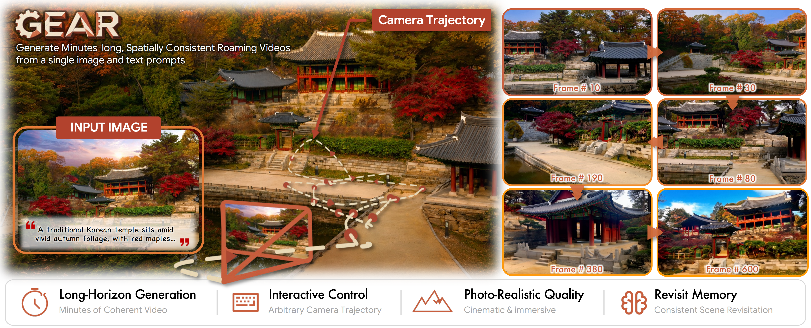
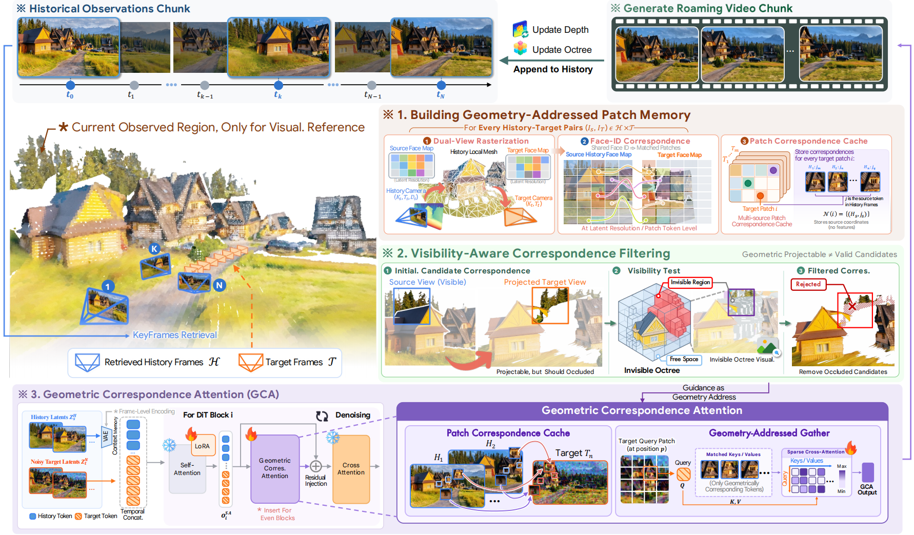

# [ARXIV 2026] Geometry as Address: Routing Attention to Visual Memory for Long-Horizon Camera-Controlled Video Generation


### [Project Page](https://zju3dv.github.io/geometry-as-address/) | [Arxiv](https://arxiv.org/abs/2606.23455)

> [Geometry as Address: Routing Attention to Visual Memory for Long-Horizon Camera-Controlled Video Generation](https://zju3dv.github.io/geometry-as-address/), \
> Zesong Yang, Weikai Chen‡, Liyuan Cui, Lutao Jiang, Runze Zhang, Yingda Yin, Xiaoyang Huang, Kai Yan, Keyang Luo, Wangguandong Zheng, Xin Wang, Hujun Bao, Zhaopeng Cui†


Abstract: *Long-horizon camera-controlled video generation requires recovering previously observed content from an ever-growing visual history. Existing approaches either search historical context implicitly or reconstruct it into persistent 3D memory, facing inefficient memory access or accumulated geometric errors. Our key insight is that geometry need not explain the scene -- it only needs to determine **where visual memory should be read from**, while attention decides **what should be recovered**. Based on this insight, we introduce GEAR, a Geometry-Enabled Attention Routing framework that uses geometry as an explicit token-level address for visual memory. Rather than fusing historical observations into a persistent global 3D representation, GEAR retains them as frame latents and uses per-frame geometry only to establish token-level correspondences with target views, thereby avoiding persistent error accumulation from global fusion. Guided by these correspondences, a proposed Geometric Correspondence Attention (GCA) selectively injects geometrically matched historical features into target noisy patches during denoising. We further introduce an Invisible Octree to accumulate visibility evidence and reject geometrically plausible but occluded correspondences. Extensive experiments demonstrate that GEAR achieves state-of-the-art visual quality, precise camera control, and revisit consistency, enabling minute-long video generation along challenging trajectories.*


## Method Overview


**System overview.** For each target chunk, GEAR constructs patch correspondences to retrieved history using per-frame geometry and filters occluded matches with the Invisible Octree. GCA then injects matched historical features into noisy target tokens during denoising, after which generated observations are appended to the history bank for continued rollout.

## ToDos
🔥 Feel free to raise any requests~
- [x] Release project page.
- [x] Release paper.
- [ ] Release Inference Codes.
- [ ] Release 4-step DMD Checkpoint

## Acknowledgement
Some codes are modified from [VideoX-Fun](https://github.com/aigc-apps/VideoX-Fun), thanks for the authors for their valuable works.

### Citation

If you find this code useful for your research, please use the following BibTeX entry.

```
@inproceedings{yang2026megas,
    title={Geometry as Address: Routing Attention to Visual Memory for Long-Horizon Camera-Controlled Video Generation},
    author={Yang, Zesong and Chen, Weikai and Cui, Liyuan and Jiang, Lutao and Zhang, Runze and Yin, Yingda and Huang, Xiaoyang and Yan, Kai and Luo, Keyang and Zheng, Wangguandong and Wang, Xin and Bao, Hujun and Cui, Zhaopeng},
    booktitle={Arxiv},
    year={2026}
}     
```